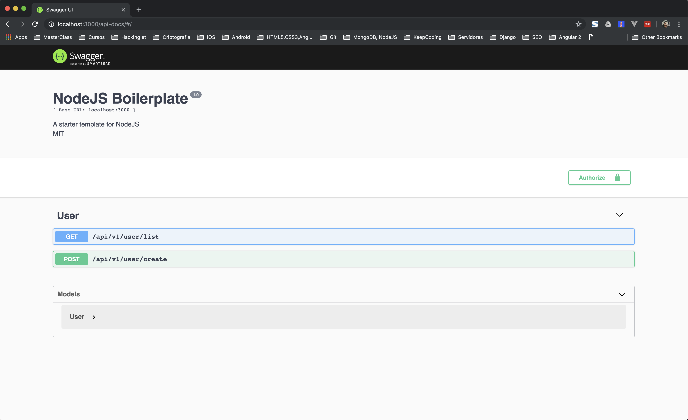

# Node.js Boilerplate &nbsp; <a href="https://github.com/skurt23/nodejs-boilerplate/stargazers"></a> <a href="https://twitter.com/Skurt23"></a>



## Stack

* [Docker][docker], [Node.js][node], [Typescript][typescript], [TSLint][tslint] — core platform and dev tools
* [Express][express], [Typescript-rest][typescriptrest], [Typescript-rest-swagger][typescriptrestswagger], [cors][cors] etc. — super HTTP-server features
* [PostgreSQL][pg], [TypeORM][typeorm] — SQL, ORM, data acess and migrations
* [Jest][jest], [Supertest][supertest] - unit, snapshot and integration testing

## Directory Layout

```bash
.
├── /src/                       # Node.js application source files
│   ├── /controllers/           # Handlers
│   ├── /dao/                   # Data abstraction objects
│   ├── /decorators/            # Custom decorators
│   ├── /models/                # Models
│   ├── /tests/                 # Unit and integration testing
│   ├── /utils/                 # Utility functions
│   ├── /index.ts               # Express application
├── docker-compose.yml          # Defines Docker services, networks and volumes
├── Dockerfile                  # Commands for building a Docker image for production
├── package.json                # List of project dependencies
```


## Prerequisites

* [Docker][docker] Community Edition v17 or higher

or

* [NodeJS][node] v11 or higher

## Getting Started

Just clone the repo and run `docker-compose build && docker-compose up`:

```bash
git clone https://github.com/skurt23/nodejs-boilerplate.git nodejs-boilerplate
cd nodejs-boilerplate                             # Change current directory to the newly created one
docker-compose build && docker-compose up         # Launch Docker containers with the Node.js app running inside
```

The API server must become available at [http://localhost:3000](http://localhost:3000) and the docs at [http://localhost:3000/api-docs](http://localhost:3000/api-docs)

## Testing

```bash
npm run lint                       # Find problematic patterns in code
npm run test                       # Run tests
```

For more information visit http://facebook.github.io/jest/ or https://github.com/visionmedia/supertest

## License

Copyright © 2019-present Skurt23. This source code is licensed under the MIT license found in the
[LICENSE.txt](https://github.com/skurt23/nodejs-boilerplate/blob/master/LICENSE.txt) file.

---
Made with ♥ by Alejandro M. Alberto ([@skurt23](https://twitter.com/Skurt23)).


[nodejsboilerplate]: https://github.com/skurt23/nodejs-boilerplate
[node]: https://nodejs.org
[express]: http://expressjs.com/
[cors]: https://github.com/expressjs/cors
[pg]: https://www.postgresql.org/
[docker]: https://www.docker.com/community-edition
[compose]: https://docs.docker.com/compose/
[supertest]: https://github.com/visionmedia/supertest
[jest]: http://facebook.github.io/jest/
[typeorm]: https://github.com/typeorm
[typescript]: https://github.com/Microsoft/TypeScript
[typescriptrest]: https://github.com/thiagobustamante/typescript-rest
[typescriptrestswagger]: https://github.com/thiagobustamante/typescript-rest-swagger
[tslint]: https://github.com/palantir/tslint
